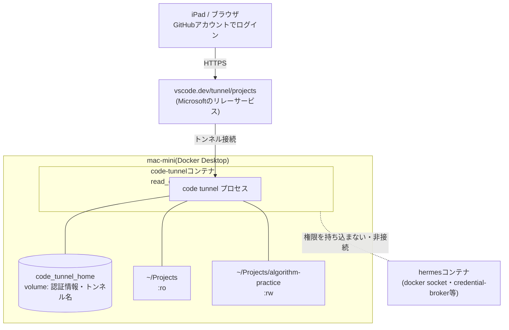

# code-tunnel

[](https://github.com/pre-commit/pre-commit)
[](https://conventionalcommits.org)

## 目次

- [1. 概要](#1-概要)
- [2. 構成図](#2-構成図)
- [3. 責任](#3-責任)
- [4. セットアップ](#4-セットアップ)
  - [4.1. ビルドと初回ログイン](#41-ビルドと初回ログイン)
  - [4.2. 常駐起動](#42-常駐起動)
  - [4.3. トンネル名を分かりやすくする](#43-トンネル名を分かりやすくする)
- [5. マウント方針](#5-マウント方針)
- [6. 運用ルール](#6-運用ルール)
- [7. Mac起動時の自動起動](#7-mac起動時の自動起動)
- [8. 設定変更時の反映手順](#8-設定変更時の反映手順)
- [9. トラブルシューティング](#9-トラブルシューティング)

## 1. 概要

code-tunnelは、[VS Code Remote Tunnels](https://code.visualstudio.com/docs/remote/tunnels)を使って、iPadなどのweb版VSCode(vscode.dev)から`~/Projects`配下のファイルへアクセスするための、単機能・低権限のコンテナです。

> [!IMPORTANT]
> このコンテナは「ファイル閲覧・編集用の入口」専用です。hermes/openclowが使う本番の実行環境([account-aiagent/container](../ai-agent/docs/architecture/structure/server/mac-mini/account-aiagent/container/README.md))とは別物であり、意図的に権限を分離しています。Docker socket・credential-broker連携・network egress許可などは一切持たせません。

## 2. 構成図



- 実線: 通信・マウント関係
- 点線: 意図的に接続していないこと([6.](#6-運用ルール)の「hermes環境との非接続」を参照)

## 3. 責任

- VS Code Remote Tunnelsを常時起動し、iPad等からの接続口を提供すること
- `~/Projects`配下のファイルを閲覧・編集可能にすること(書き込みは[5.](#5-マウント方針)で許可したプロジェクトのみ)
- 書き込み許可したプロジェクトについて、最低限のgit操作(`git add`/`commit`等)を可能にすること

対象外(out-of-scope):

- hermes/openclowの実行(別コンテナが担う)
- Dockerのビルド・実行(プロジェクトごとにDocker環境が必要な場合は、rootless DinDなど別途隔離された仕組みを検討する。このコンテナにdocker.sockを持ち込まない)
- Nix/direnvなどプロジェクト固有の開発ツールチェーンの提供(実測したところイメージが数GB規模に膨らむため採用しない。この種の作業はMac本体へSSHで接続して行う。責任を「軽量な閲覧・編集・commit専用の入口」と「重い開発作業」に分離する)
- `git push`(認証情報を持ち込んでいないため未対応。将来対応する場合はスコープを絞ったPAT注入を別途検討する)

## 4. セットアップ

### 4.1. ビルドと初回ログイン

```bash
docker compose build

# 初回は対話モードでログインする(device codeの案内が出る)
docker compose run --rm code-tunnel
```

表示されたURL(`https://github.com/login/device`)とコードでGitHubアカウントにログインし、トンネル接続が確立したら`Ctrl+C`で終了します。認証情報は`code_tunnel_home`ボリュームに保存されるため、以後は不要です。

### 4.2. 常駐起動

```bash
just up
docker compose logs --tail=50 -f
```

`just up`は`~/Projects`が無ければ作成してから`docker compose up -d`を実行します(`docker compose up -d`を直接使うと、`~/Projects`が存在しない場合にエラーも出ずコンテナ内だけ空フォルダに見える、というサイレントな罠があるため)。

ログに`Open: https://vscode.dev/tunnel/{tunnel-id}`と表示されれば起動完了です。このURLをiPadのSafari等で開き、同じGitHubアカウントでサインインするとアクセスできます。

### 4.3. トンネル名を分かりやすくする

名前を指定せずに初回ログインすると、`42a5c7da1338`のようなランダムな16進数の名前が自動で割り当てられます。分かりやすい名前に変更するには、コンテナ内で`rename`サブコマンドを実行します。

```bash
docker exec code-tunnel /home/tunnel/code tunnel rename projects
```

> [!NOTE]
> `rename`は実行中のトンネルプロセスとは別のCLIプロセスとして動くため、**すでにログイン済みでも、もう一度device codeでのログインを求められることがあります**。表示されたURL・コードで再度ログインしてください。

> [!IMPORTANT]
> `rename`が発行する認証は、メインのトンネルプロセスとは別トークンとして`code_tunnel_home`ボリュームに書き込まれます。メインプロセスはこれに気づかず、古いdevice codeの入力待ちのまま止まっていることがあるため、rename後は必ず以下で再起動し、新しいトークンを読み直させてください。
>
> ```bash
> docker compose restart code-tunnel
> docker compose logs --tail=20
> ```
>
> ログに`➜ Tunnel: {指定した名前}`と`➜ Open: https://vscode.dev/tunnel/{指定した名前}`が出れば成功です。

## 5. マウント方針

`~/Projects`全体を読み取り専用でマウントし、書き込みを許可するプロジェクトだけ個別に上書きマウントします(Dockerは、親ディレクトリの上に子ディレクトリを別マウントすると、その部分だけ設定が優先されます)。

```yaml
volumes:
  - ~/Projects:/home/tunnel/Projects:ro
  - ~/Projects/algorithm-practice:/home/tunnel/Projects/algorithm-practice:rw
```

書き込みを許可するプロジェクトを増やす場合は、同じ形式で1行追加します。

```yaml
- ~/Projects/{project-name}:/home/tunnel/Projects/{project-name}:rw
```

> [!NOTE]
> `~/Projects`直下に秘密情報を含むファイル(`.env`等)を置かないでください。ディレクトリ全体が(読み取り専用ではあっても)このコンテナから見える前提で運用します。

git commitの著者情報(`user.name`/`user.email`)は、リポジトリ直下の[`gitconfig`](./gitconfig)を`/home/tunnel/.gitconfig`へ読み取り専用でマウントする形で渡しています。Dockerfileに焼き込まない理由は、変更のたびにイメージを再ビルドせずに済むためです。値を変えたい場合は`gitconfig`を編集して`just up`するだけで反映されます。

## 6. 運用ルール

| 項目 | ルール |
| --- | --- |
| 認証アカウント | [account-private](../ai-agent/docs/architecture/structure/server/mac-mini/account-private/README.md)の管理者アカウントとは別の、権限を絞ったGitHubアカウントでログインする |
| 2FA | 上記アカウントはパスキー/2FA必須にする(このアカウント1つがiPadからの唯一の鍵になるため) |
| トンネルの棚卸し | GitHub側にトンネル専用の一覧ページは無い。不要になったマシンは`code tunnel unregister`(CLI)、またはVS CodeのRemote Explorerビューで対象マシンを右クリック→`Unregister`で解除する。アカウント単位で全トンネルをまとめて無効化したい場合のみ、[GitHubのOAuth Apps設定](https://github.com/settings/applications)で「Visual Studio Code」の認可を取り消す(粒度が粗い点に注意) |
| イメージの更新 | `docker compose build --no-cache`を定期的に実行し、VS Code CLI本体のセキュリティパッチを取り込む |
| `code_tunnel_home`ボリューム | 認証情報の実体。パスワード同等の機密情報として扱い、無断でバックアップ・複製・持ち出ししない |
| hermes環境との非接続 | docker socket・credential-broker発行トークン・network egress許可など、hermes側の実行権限をこのコンテナに持ち込まない([コンテナ分離の判断](../ai-agent/docs/architecture/structure/server/mac-mini/account-aiagent/container/README.md)を参照) |

## 7. Mac起動時の自動起動

Mac再起動後も自動で復帰させるには、次の2つをOS側で設定します(このリポジトリの管理外、手動設定)。

1. `Docker Desktop > Settings > General > Start Docker Desktop when you log in`を有効化
2. `システム設定 > ユーザとグループ > 自動ログイン`で対象アカウントを設定

`restart: unless-stopped`により、Docker Desktopが起動すればこのコンテナも自動で立ち上がります。

## 8. 設定変更時の反映手順

変更した箇所によって必要な操作が異なります。

| 変更箇所 | 必要な操作 |
| --- | --- |
| `docker-compose.yml`のみ(volumes、restartポリシー等) | `just up`(イメージは変わらないため再ビルド不要) |
| `Dockerfile` | `docker compose up -d --build`(再ビルドしないと変更が反映されない) |

```bash
cd ~/Projects/code-tunnel

docker compose config          # (任意)yamlの文法確認
just up                        # 反映
docker compose ps              # 状態確認
docker compose logs --tail=50 -f
```

## 9. トラブルシューティング

| 症状 | 原因 | 対処 |
| --- | --- | --- |
| `the vscode gateway is not currently running` | 開こうとしたパスがコンテナ内に存在しない | [5.](#5-マウント方針)のマウント設定を確認し、パスが`/home/tunnel/Projects/...`配下になっているか確認する |
| ビルド失敗(`tar`関連のexit code 2) | VS Code CLIのダウンロードURLの`os`パラメータが誤っている | Ubuntuベースの場合は`cli-alpine-{arch}`が正しい値(`cli-linux-{arch}`は存在しない) |
| 再起動後にiPadから繋がらない | `code tunnel`プロセス自体が起動していない、または認証情報が永続化されていない | `docker compose ps`でコンテナが`Up`か確認し、`docker compose logs`でログイン状態を確認する |
| `rename`後もログが古いdevice codeの入力待ちのまま進まない | メインのトンネルプロセスと`rename`が別々に認証し、メインプロセスが新しいトークンに気づいていない | [4.3.](#43-トンネル名を分かりやすくする)の通り`docker compose restart code-tunnel`で読み直させる |
| `~/Projects`配下が空に見える(エラーは出ない) | `~/Projects`がホスト側に存在しないまま`docker compose up -d`を直接実行した。Docker Desktop(Mac)はこの場合エラーを出さず、コンテナ内だけに見かけ上の空フォルダを作る | `docker compose up -d`ではなく`just up`を使う(`~/Projects`を事前に作成してから起動する) |
| Dockerfileに追加した設定(`git config`等)が反映されない | `code_tunnel_home`ボリュームは初回作成時にしかイメージの内容をコピーしない。既にボリュームが存在する状態で再ビルドしても、そのボリューム配下のファイルは上書きされない | `docker exec code-tunnel git config --global ...`のように、稼働中のコンテナへ直接設定を当てる |
